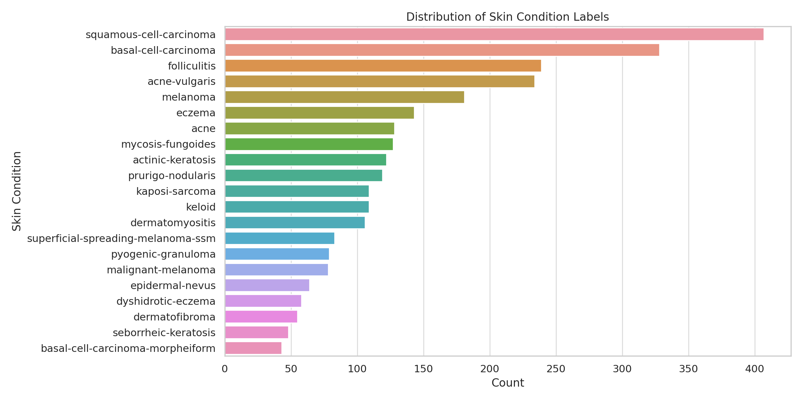

# Equitable AI for Dermatology 

This repository contains our submission for Break Through Tech AI x Algorithim Justice League (AJL) Kaggle competition. As fellows from the Break Through Tech AI Program, we’re building an inclusive machine learning model to classify 21 dermatological conditions across diverse skin tones. The ultimate goal of this project is to center fairness, transparency, and equity within healthcare.

# Project Overview

This challenge is part of the Break Through Tech AI Program, which empowers undergraduate women and non-binary students through hands-on experience in real-world AI applications. In collaboration with the Algorithmic Justice League (AJL), the goal of this competition is to address systemic bias in dermatology AI tools—particularly their underperformance on darker skin tones.

# Objectives

- Build a multiclass image classifier for 21 skin conditions

- Ensure fairness across skin tones using AI explainability and bias detection tools

- Document the full journey with visualizations and narratives that center marginalized perspectives

# Goals
- Achieve strong classification performance on the leaderboard (weighted F1 score)

- Deliver a transparent and fair model with visualizations and insights

- Contribute to the AI fairness movement in healthcare by centering marginalized voices

# Evaluation
Models are evaluated using the weighted average F1 score, accounting for class imbalances in the dataset.

# Tools & Frameworks - update after submission
- Python, PyTorch / TensorFlow

- scikit-learn

- OpenCV
  
- Fairlearn, SHAP, Grad-CAM (for fairness and explainability)

# Data Exploration
Our training dataset includes metadata and image labels for 2,860 dermatology images, with each sample annotated by:

- Skin condition label (21 unique conditions)

- Fitzpatrick scale (1–6): a common dermatological measure of skin tone

- DDI scale: a custom, more granular skin tone score

- Three- and nine-partition labels: broader groupings for diagnosis categories

- QC flags: quality control metadata (limited availability)

# Preprocessing Steps
To prepare the dataset, we:

1. Verified data consistency and handled missing values

2. Converted categorical labels into machine-learning-ready formats

3. Applied data augmentation techniques (flipping, rotation, brightness adjustments) to boost diversity and address class imbalance

4. Incorporated fitzpatrick_scale and ddi_scale into our fairness evaluation pipeline

# Key Insights from EDA: 

-  Skin Condition Distribution

- The dataset is imbalanced, with conditions like prurigo nodularis and seborrheic keratosis appearing far more frequently than others.

- This imbalance can affect model performance, especially for underrepresented conditions—making techniques like class weighting or focal loss important.

 - Fitzpatrick Skin Tone Distribution

- Skin tones are unevenly distributed across the Fitzpatrick scale, with mid-tones (Types 3–5) being the most common.

- Lighter and darker skin types are underrepresented, which may introduce bias in dermatology models unless explicitly corrected.

-  DDI Scale Distribution

- The DDI scale provides more granularity than the Fitzpatrick scale.

- However, the distribution is still skewed toward mid-range tones, reinforcing the need for inclusive model design.

# Team Members 
- Victoria Kim
- Amanda Tsui
- Yasmeen Shilbayeh
- 

